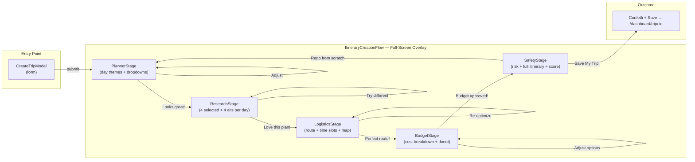

# Itinerary Creation Flow — Full Agent Pipeline UI

## Architecture Overview

## Execution Sections

### Section 1 — Foundation (build first, everything depends on this)

**Shared types** (`src/ui/components/itinerary-flow/types.ts`):

- `FlowStage` enum: `planner | research | logistics | budget | safety`
- `FlowState` interface: current stage, all accumulated agent data, iteration count, session ID
- `useFlowState` hook: state machine transitions, `resetAllAndRestart()`, localStorage persistence for session resume

**6 API routes** (`src/app/api/ai/itinerary-flow/[stage]/route.ts`):

- Each wraps the existing agent class from `src/agents/`
- All authenticate via the existing JWT cookie pattern (same as other API routes)
- Each returns typed JSON matching the agent output

### Section 2 — Shared UI Primitives (build once, reused by all 5 stages)

`**AgentThinkingCard`** — the heartbeat of every loading state:

- Each of the 5 agents has a distinct identity:

| Agent           | Icon   | Color  | First-person message                                                  |
| --------------- | ------ | ------ | --------------------------------------------------------------------- |
| Planner         | Brain  | Indigo | "Analyzing your travel intent and building a day-by-day blueprint..." |
| Research (Evan) | Globe  | Teal   | "Scouring the web for the best experiences in your destination..."    |
| Logistics       | Route  | Amber  | "Calculating the most efficient path through your activities..."      |
| Budget          | Wallet | Green  | "Tallying every cost so there are no surprises on the road..."        |
| Safety          | Shield | Purple | "Assessing risk signals and preparing your safety briefing..."        |

- Typewriter log lines appear one by one (agent-specific, 6–8 lines per agent)
- Breathing glow animation on the agent avatar
- Precisely-shaped skeleton loading in the results area below (matches exact final layout)
- Responsible AI badge: "Transparent AI · [Agent Name]"
- If API fails: error state within the card — agent avatar turns rose, message "Agent encountered an issue", retry button

`**AgentPipelineHeader`**:

- 5 agent nodes connected by animated fill lines (left-to-right as stages complete)
- Active node: pulsing ring + spinning inner dot
- Completed node: green checkmark
- Between-stage transition: 1.2s animated "data packet" dot travels along the line from completed node to next node (visualizes the actual agent handoff)
- Top-right: iteration counter badge — "Run #1", "Run #2" etc. (increments on every Redo)
- Collapses to numbered step dots on mobile

`**TripDNASummaryStrip`** — sticky strip below the header, builds up as stages complete:

- After Planner: `Paris · 5 days · Balanced style · Moderate pace`
- After Research: `+ 18 activities selected · Hotel: Le Marais district`
- After Logistics: `+ Route optimized · 42 km · ~6h travel`
- After Budget: `+ $2,847 estimated · Within budget`
- This gives the user orientation at every stage without needing to scroll back

`**ExplainabilityPanel`** — slide-in from right, triggered by "Why?" button on every stage:

- Agent name + role description
- Data sources used (e.g. "Bright Data web search, 14 sources")
- Confidence level indicator
- What this agent explicitly did NOT do (builds trust)
- "Learn more in Admin" link → `/admin/agents`
- Keyboard shortcut: `?` to toggle
- Full ARIA labeling, focus trap while open

### Section 3 — Stage Components (build in pipeline order)

**PlannerStage**:

- Loading: `AgentThinkingCard` with planner log lines
- Results:
  - Destination hero banner — Unsplash API photo for the destination (graceful gradient fallback if unavailable); large destination name overlaid with glassmorphism card
  - Dates row, travel style badge, pace indicator
  - Day theme cards — each has day number, theme name, a dropdown to swap theme from 7 predefined options (Arrival & Orientation / Culture & Landmarks / Nature / Local Life / Hidden Gems / Adventure / Leisure)
  - Preference chips row: budget amount, style, pace — each chip is editable inline
- Decision gate: "This looks great! ✨" (green) | "Adjust the plan" (outline) — Adjust expands an inline feedback textarea; submitting re-calls the planner API with the feedback appended

**ResearchStage**:

- Loading: `AgentThinkingCard` with research log lines
- Results: Accordion per day (all expanded by default):
  - 4 selected activity cards — each has name, type pill, estimated cost, inline "Why?" tooltip (shows AI reasoning for selection), and a deselect toggle (× icon)
  - "Swap in" alternatives row — 4 alternative activity cards; clicking one swaps it into the selected slot
  - Undo swap button (↩ icon) appears after any swap — tracks up to 5 undo steps
  - "Compare" button on any two activities opens a side-by-side comparison modal: name, type, cost, AI reasoning, distance estimate from hotel
  - Hotel selection: horizontal scroll of 3–5 hotel cards; tap to select (highlighted border); shows name, price tier ($ to $$$$), area, tags, star rating
- Decision gate: "Love this plan!" | "Find different options" (with optional feedback textarea)

**LogisticsStage**:

- Loading: `AgentThinkingCard` + map area shimmer skeleton
- Results: Two-column layout (stacks on mobile)
  - Left: Day-by-day timeline — activities grouped into Morning / Afternoon / Evening slots with time labels (08:00, 12:00, 17:00 etc.)
  - Right: Mapbox GL map — numbered circular pins (one color per day), animated polyline route drawing in on load
  - Bottom stats bar: total distance (km), estimated travel time, "Route Efficiency" circular ring gauge (0–100%)
- Decision gate: "Perfect route!" | "Re-optimize" with optional note field

**BudgetStage**:

- Loading: `AgentThinkingCard` with log lines; numbers count up from 0 to final value when results appear (Framer Motion `useMotionValue` + `useTransform`)
- Results:
  - Hero cost display: large number (total estimated) vs your budget — green if under, amber if close, rose if over
  - D3 donut chart: segments for Hotels / Activities / Transport / Food — hover shows tooltip with amount + %
  - Per-day cost accordion — each day expands to show line items with amounts
  - Currency selector (dropdown with flag icons): USD / EUR / GBP / JPY / INR / AUD
  - If over budget: `BudgetAgent` suggestions appear as amber swap cards — each shows "Replace X with Y → save $Z"
- Decision gate: "Budget approved!" | "Adjust options"

**SafetyStage**:

- Loading: `AgentThinkingCard` with safety-specific log lines; shield icon animates a scan sweep
- Results — three sections in sequence:
**Section 1 — Safety Report**
  - Risk level badge (Low / Medium / High) — green / amber / rose respectively; full-width colored banner with explanation sentence
  - Warnings list: amber alert cards with triangle icon + warning text
  - Traveler tips list: green cards with lightbulb icon + tip text
  **Section 2 — Your Complete Itinerary (the payoff moment)**
  - Each day rendered as a full card: day number, date, theme as header
  - Each activity row: time range (09:00–11:00), activity name, type pill, cost
  - Hotel callout card at bottom of each day: name, area, price tier, stars
  - Grand total cost + budget comparison banner
  **Section 3 — VoyageAI Trip Score**
  - 5 horizontal progress bars with color fills:
    - Adventure (blue), Culture (indigo), Food (amber), Relaxation (green), Value (teal)
  - Short insight line: "Your trip is 74% culture-focused — consider a free day for spontaneity"
- Decision gate (sticky bottom bar that stays fixed as user scrolls the itinerary):
  - "Save My Trip!" — large green gradient CTA
  - "Redo from Scratch" — outline button; triggers `resetAllAndRestart()` in `useFlowState`, resets the DNA strip, resets the pipeline header to stage 1 with a "restart" sweep animation, increments the iteration counter

### Section 4 — Orchestrator + Polish

`**ItineraryCreationFlow`** (the master component):

- Renders as a full-screen fixed overlay (`z-50`, `inset-0`, `bg-[#0A0D12]`) — not a modal, takes over the full viewport for focus
- Mounts `AgentPipelineHeader` + `TripDNASummaryStrip` fixed at top; stage content scrolls below
- Stage transitions: `AnimatePresence` + `motion.div` with `initial={{ opacity: 0, y: 24 }}` → `animate={{ opacity: 1, y: 0 }}` → `exit={{ opacity: 0, y: -16 }}` + spring easing
- Session resume: on mount, checks `localStorage` for a saved flow session — if found, shows a toast: "Resume your Paris trip planning?" with Resume / Start fresh buttons
- Keyboard shortcuts bar (fixed bottom-left, subtle): `Enter` = approve · `Esc` = adjust · `?` = explain · `→` = next day accordion

**Save Celebration**:

- On "Save My Trip!" click: `canvas-confetti` burst (green + gold + white particles from both sides of screen)
- Success toast slides in: "Your trip is saved! Opening your itinerary..."
- 1.8s delay then `router.push(/dashboard/trip/:id)`

**Error Recovery**:

- Any failed API call: the `AgentThinkingCard` transitions to error state with retry button
- Network errors: global toast with "Check your connection and try again"
- Partial failures (e.g. Unsplash photo unavailable): silent graceful fallback, no disruption

### Section 5 — Integration (final wiring)

- `[src/ui/dashboard/CreateTripModal.tsx](src/ui/dashboard/CreateTripModal.tsx)`: after successful `createTrip()` returns a `tripId`, instead of redirecting, render `<ItineraryCreationFlow tripId={...} input={...} />` overlay
- `[src/app/dashboard/page.tsx](src/app/dashboard/page.tsx)`: update `onTripCreated` callback chain so redirect happens after flow saves
- Mobile responsive pass: pipeline header → step dots, day accordions → full-width swipeable cards, decision gate → bottom sheet, ExplainabilityPanel → full-screen bottom sheet on mobile

## Files to Create (19 new)

- `src/ui/components/itinerary-flow/types.ts`
- `src/ui/components/itinerary-flow/useFlowState.ts`
- `src/ui/components/itinerary-flow/ItineraryCreationFlow.tsx`
- `src/ui/components/itinerary-flow/AgentPipelineHeader.tsx`
- `src/ui/components/itinerary-flow/AgentThinkingCard.tsx`
- `src/ui/components/itinerary-flow/TripDNASummaryStrip.tsx`
- `src/ui/components/itinerary-flow/ExplainabilityPanel.tsx`
- `src/ui/components/itinerary-flow/stages/PlannerStage.tsx`
- `src/ui/components/itinerary-flow/stages/ResearchStage.tsx`
- `src/ui/components/itinerary-flow/stages/LogisticsStage.tsx`
- `src/ui/components/itinerary-flow/stages/BudgetStage.tsx`
- `src/ui/components/itinerary-flow/stages/SafetyStage.tsx`
- `src/app/api/ai/itinerary-flow/planner/route.ts`
- `src/app/api/ai/itinerary-flow/research/route.ts`
- `src/app/api/ai/itinerary-flow/logistics/route.ts`
- `src/app/api/ai/itinerary-flow/budget/route.ts`
- `src/app/api/ai/itinerary-flow/safety/route.ts`
- `src/app/api/ai/itinerary-flow/save/route.ts`

## Files to Modify (2)

- `[src/ui/dashboard/CreateTripModal.tsx](src/ui/dashboard/CreateTripModal.tsx)`
- `[src/app/dashboard/page.tsx](src/app/dashboard/page.tsx)`

## Design Tokens

- Background: `#0A0D12` / `#10141a`, glass cards `bg-white/[0.04–0.06]`
- Approve CTAs: `#10B981` (green)
- Agent colors: Indigo (Planner) · Teal (Research) · Amber (Logistics) · Green (Budget) · Purple (Safety)
- Warnings: `amber-400/500` · Errors / high-risk: `rose-400/500`
- Stage transitions: Framer Motion spring, `stiffness: 300, damping: 30`
- Typography: Geist Sans variable font, bold headings, `text-slate-400` secondary
- Reduced motion: all animations wrapped in `useReducedMotion()` check — instant transitions when preferred

