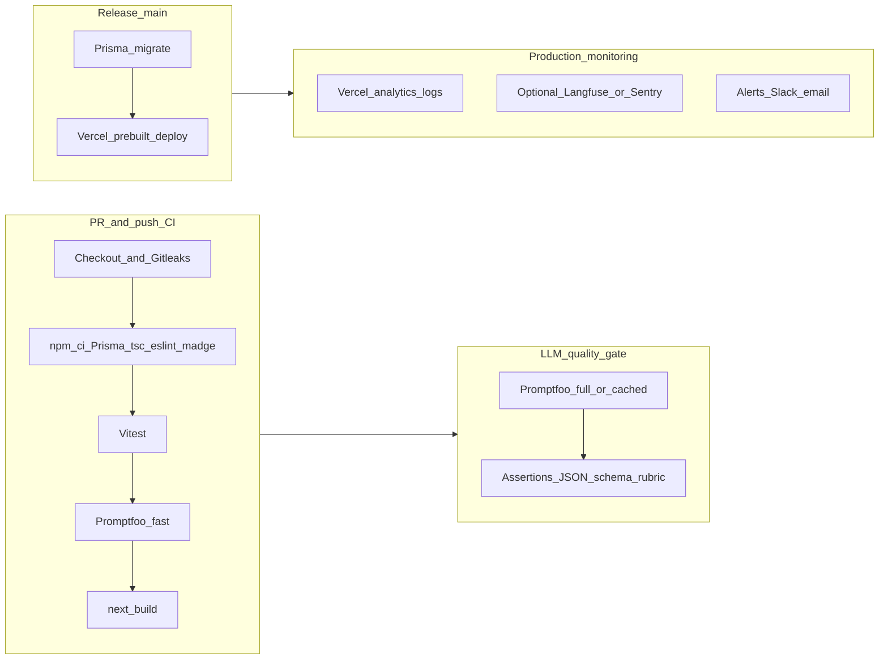

# LLMOps pipeline for this codebase

## What you have today

- **App**: Single Next.js 16 app (`[package.json](d:/NUISS/AI-project/package.json)`) deployed via Vercel (`[.github/workflows/release.yml](d:/NUISS/AI-project/.github/workflows/release.yml)`); no Dockerfiles.
- **LLM layer**: `[src/lib/ai/llm.ts](d:/NUISS/AI-project/src/lib/ai/llm.ts)` (`mock` | `openai` | `gemini`), agent prompts in `[src/agents/planner/plannerPrompts.ts](d:/NUISS/AI-project/src/agents/planner/plannerPrompts.ts)`, `[src/agents/research/researchPrompts.ts](d:/NUISS/AI-project/src/agents/research/researchPrompts.ts)`, plus tools/services using `[buildFullPrompt](d:/NUISS/AI-project/src/lib/ai/prompts/index.ts)`.
- **CI**: `[.github/workflows/ci.yml](d:/NUISS/AI-project/.github/workflows/ci.yml)` runs Gitleaks, Prisma, `tsc`, ESLint, `madge`, `next build`, with `LLM_PROVIDER=mock`—but **does not run `npm test` (Vitest)** despite `[vitest.config.ts](d:/NUISS/AI-project/vitest.config.ts)` and `[src/orchestrator/__tests__/](d:/NUISS/AI-project/src/orchestrator/__tests__/agentOrchestrator.test.ts)`.
- **Security**: `[.github/workflows/codeql.yml](d:/NUISS/AI-project/.github/workflows/codeql.yml)` (JavaScript/TypeScript).

## Target architecture (MLOps diagram → LLMOps)

- **“Data validation” (ML)** → **Prompt/input validation**: keep leaning on **Zod** in `[src/infrastructure/env.ts](d:/NUISS/AI-project/src/infrastructure/env.ts)` and AI schemas under `[src/lib/ai/schemas/](d:/NUISS/AI-project/src/lib/ai/schemas/index.ts)`; Promptfoo adds **behavioral** checks on top.
- **“Train & evaluate”** → **Prompt + agent behavior**: **Promptfoo** eval suites + Vitest for orchestration logic.
- **“Model validation”** → **Promptfoo assertions** (contains, JSON schema, similarity, model-graded rubrics where you enable them).
- **“Register model”** → **Git tags + PR reviews** for prompt changes; optional later: store eval baselines in-repo (Promptfoo outputs / snapshots).
- **“Monitoring / drift”** → **Production observability** (below); Promptfoo on a **schedule** or **post-merge** catches regressions before they become incidents.

## Tools to use (named explicitly)

| Area                         | Tool                                                           | Role                                                                                                                               |
| ---------------------------- | -------------------------------------------------------------- | ---------------------------------------------------------------------------------------------------------------------------------- |
| Unit / integration tests     | **Vitest**                                                     | Already in `[package.json](d:/NUISS/AI-project/package.json)`; must be wired into CI.                                              |
| Prompt regression & LLM eval | **Promptfoo** (`@promptfoo/cli`)                               | Declarative evals, assertions, optional red-team; primary LLM-specific gate you asked for.                                         |
| Secret scanning              | **Gitleaks**                                                   | Already in CI.                                                                                                                     |
| SAST                         | **CodeQL**                                                     | Already on `main` PRs; keep.                                                                                                       |
| Optional extra SAST / policy | **Semgrep** or **SonarCloud**                                  | Only if you want SonarQube-like reporting beyond CodeQL; not required for a strong baseline.                                       |
| Dependency risk              | `**npm audit`** or **OSV-Scanner (`google/osv-scanner-action`) | Complements npm; cheap to add as a job step.                                                                                       |
| Container image scan         | **Trivy**                                                      | **Skip until you ship Docker images** (you have none today).                                                                       |
| LLM observability (prod)     | **Langfuse**, **Helicone**, or **Sentry** (+ Vercel logs)      | Trace latency, errors, and prompt versions; “Evidently-for-LLM” is usually **your metrics + eval cadence**, not one magic library. |
| Dashboards / alerts          | **Grafana Cloud** or **Datadog** + **Slack**                   | If you need off-Vercel alerting; Vercel notifications cover many teams.                                                            |

## GitHub Actions layout (concrete)

1. **Update `[ci.yml](d:/NUISS/AI-project/.github/workflows/ci.yml)`**

- After install / before or after build: run `**npm run test**` (Vitest).
- Add a **Promptfoo** step, e.g. `npx promptfoo eval -c promptfooconfig.yaml` (exact flags depend on chosen provider strategy).
- **Two-tier strategy (recommended “best”)**
  - **Every PR**: Promptfoo using a **no-secret** path—e.g. **custom Node provider** or **scripted provider** that exercises `[MockLLMClient](d:/NUISS/AI-project/src/lib/ai/llm.ts)` / thin wrapper so forks and external PRs stay green without API keys.
  - **Branch `main` or `workflow_dispatch` / `schedule`**: Optional job **“Promptfoo (live)”** gated on `secrets.OPENAI_API_KEY` or `GEMINI_API_KEY` for full provider runs, stricter thresholds, and optional upload of HTML/JSON reports as **artifacts**.

1. **New config in repo root**

- `promptfooconfig.yaml` (or `promptfoo.config.yaml`) defining **providers** (OpenAI / Google matching your app), **prompts** (start with high-impact paths: planner + research prompts, then expand), and **tests** with **assert** blocks (JSON validity, required fields, forbidden phrases).
- Add `**@promptfoo/cli` to `devDependencies` and a script like `"promptfoo:eval": "promptfoo eval"`.

1. **Optional** `[.github/workflows/llm-nightly.yml](d:/NUISS/AI-project/.github/workflows/llm-nightly.yml)`

- Cron: weekly/daily Promptfoo live eval + `npm test` to catch **provider-side drift** and dependency breakage.

1. **Release path**

- Keep `[release.yml](d:/NUISS/AI-project/.github/workflows/release.yml)` as-is for migrate + Vercel.
- Optional: add a **smoke** step after deploy (HTTP check to `/api/health` or similar) only if you add a stable health route—do not block release on full LLM calls.

## Implementation notes tied to your code

- **Provider alignment**: Promptfoo configs should use the **same** models as `[src/lib/ai/modelRouter.ts](d:/NUISS/AI-project/src/lib/ai/modelRouter.ts)` / env (`OPENAI_API_KEY`, `GEMINI_API_KEY`, `LLM_PROVIDER`) so evals match production behavior.
- **Scope evals incrementally**: Start with **structured JSON outputs** (planner/research) because they map cleanly to schema assertions; add chat-style prompts later with rubric or model-graded evals if needed.
- **Cost & forks**: Never rely on secrets for default PR CI; use the gated job pattern for live API evals.

## Success criteria

- Every PR: **Vitest + ESLint + typecheck + build + Promptfoo (fast path)**.
- `main` (optional): **Promptfoo live** with artifacts and failure thresholds.
- Clear **list of tools** in docs only if you ask for a README update (per your preference to avoid unsolicited markdown).
