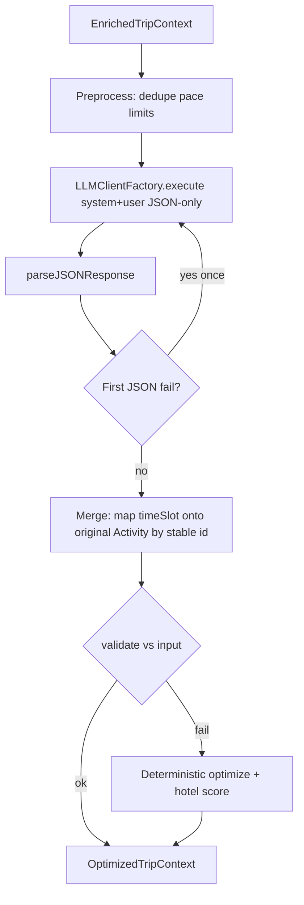

# Logistics Agent (TypeScript) — Implementation Plan

## Current state

- `[src/agents/logistics/logisticsAgent.ts](d:\NUISS\AI-project\src\agents\logistics\logisticsAgent.ts)` is a stub with `execute`, not `run`.
- Your spec types (`EnrichedTripContext`, etc.) are **not** defined elsewhere in the repo (grep is clean).
- LLM utilities: `[LLMClientFactory.create()](d:\NUISS\AI-project\src\lib\ai\llm.ts)`, `[parseJSONResponse](d:\NUISS\AI-project\src\lib\ai\llm.ts)`, `[LLMRequestOptions](d:\NUISS\AI-project\src\lib\ai\types.ts)` (`temperature`, etc.).
- `[MockLLMClient](d:\NUISS\AI-project\src\lib\ai\llm.ts)` returns generic JSON for unknown prompts — **not** a valid logistics payload. Any implementation that relies on mock JSON alone will always fall through to fallback unless the mock is extended (optional).

## Architecture

## 1. Types and exports

- Define and export in `**logisticsAgent.ts**` (single source per your file constraint): `Activity`, `HotelOption`, `EnrichedDay`, `EnrichedTripContext`, `ScheduledActivity`, `OptimizedDay`, `OptimizedTripContext` exactly as specified.
- Export `class LogisticsAgent` with `**async run(context: EnrichedTripContext): Promise<OptimizedTripContext>**` (replace stub `execute`).

## 2. Preprocessing (bonus + rules)

- **Deduplicate** activities within each day (normalize name: trim/lowercase; key `type|normalizedName`).
- **Target count per day** from `preferences.pace` (map strings like `slow|relaxed` → 3, default/medium → 4, `fast|packed` → 5), **clamped to 3–5**. If a day has more than the target, keep the first _N_ after dedupe (or drop lowest-priority duplicates — document one clear rule, e.g. keep diversity of `type` first).
- Do **not** change `destination`, `startDate`, `endDate`, `durationDays`, or day count.

## 3. LLM call

- `const client = LLMClientFactory.create();`
- `messages`: `system` = role (logistics only: reorder, time slots, one hotel from list, JSON only, no markdown, no extra keys), constraints from your scheduling/hotel rules; `user` = `JSON.stringify` of the **preprocessed** context (or original if you skip preprocess before LLM — prefer one consistent object).
- Options: `temperature` in **0.3–0.5** (e.g. `0.4`), reasonable `maxTokens`, `timeoutMs` if needed.
- **No** `executeWithRetry` for JSON parse failures — your spec is explicit: **retry the LLM once** if JSON parse fails, then give up on LLM path.

## 4. Parse and merge-back (preserve data)

- Use `parseJSONResponse` inside try/catch; on failure, retry LLM **once**; on second failure, go to deterministic fallback.
- After successful parse, **do not trust** model copies of `estimatedCost` / `description`. For each returned activity, **match** to the corresponding input activity for that `day` by `(name, type)` (and optionally description equality as tie-breaker). Build `ScheduledActivity` as `{ ...originalActivity, timeSlot }`. If any activity cannot be matched → treat as **validation failure** → deterministic fallback.
- **Hotel**: Parsed `selectedHotel` must **deep-match** one of `context.hotels` (at minimum `name` + `priceRange`; preferably full object equality). If not in list → run **deterministic hotel selection** (same scorer as fallback).

## 5. Validation (your §11)

- `days.length === context.days.length`.
- Each day: `day` and `theme` unchanged from input (string equality).
- Each `timeSlot` ∈ `morning | afternoon | evening`.
- `activities.length` per day: **≥ 1** and **≤ 5** (after preprocess, enforce before LLM).
- `selectedHotel` present and valid (from list or replaced by deterministic pick).
- **No empty** activity arrays: if input had an empty day, preprocess should add one low-impact placeholder (e.g. type `experience`, “Flexible time in [destination]”) so validation always passes — only if you can receive empty days; otherwise document assumption “non-empty input”.

## 6. Deterministic fallback (never crash)

- **Ordering**: Group by slot preference — `attraction` → morning first, `experience` → afternoon, `restaurant` → evening; within a slot, alternate types to avoid consecutive identical `type` where possible; avoid two `attraction` back-to-back across adjacent slots (swap with experience if needed).
- **“Area / zig-zag”**: Lightweight proxy — extract tokens from `description` + `theme` and prefer ordering that alternates “indoor/outdoor” or keyword clusters if you keep it simple (optional: simple string similarity to cluster).
- **Hotel selection**: Score each `HotelOption`: overlap of `area`/tags with concatenated activity text + destination; penalize `$$$$` when `preferences.budget` is below a threshold (e.g. < 1500 USD heuristic tiers); prefer higher `rating` when tie; **bonus**: prefer `area` containing “central” / “downtown” when multiple days mention similar areas.
- If `hotels.length === 0`, use a **single static placeholder** `HotelOption` (e.g. `name: "Accommodation — to be confirmed"`, `priceRange: "$$"`, `area: destination`, `tags: []`) so `selectedHotel` always exists without throwing.

## 7. Optional dev improvement (small change outside agent)

- Add one `if` branch in `MockLLMClient.generateMockResponse` in `[src/lib/ai/llm.ts](d:\NUISS\AI-project\src\lib\ai\llm.ts)` when the prompt mentions logistics / structured `EnrichedTripContext`, returning JSON that passes merge validation — **only if** you want mock to exercise the LLM path; otherwise deterministic fallback alone is enough for CI.

## 8. Files to touch

| File                                                                                                   | Change                                                           |
| ------------------------------------------------------------------------------------------------------ | ---------------------------------------------------------------- |
| `[src/agents/logistics/logisticsAgent.ts](d:\NUISS\AI-project\src\agents\logistics\logisticsAgent.ts)` | Full implementation: types, `run`, helpers, validation, fallback |
| `[src/lib/ai/llm.ts](d:\NUISS\AI-project\src\lib\ai\llm.ts)`                                           | Optional: mock branch for logistics JSON                         |

## 9. Out of scope (per your §2)

- No new activities from the model except explicit placeholder for empty-day edge case; no destination/date edits; no budget totals; no calls to other agents.
