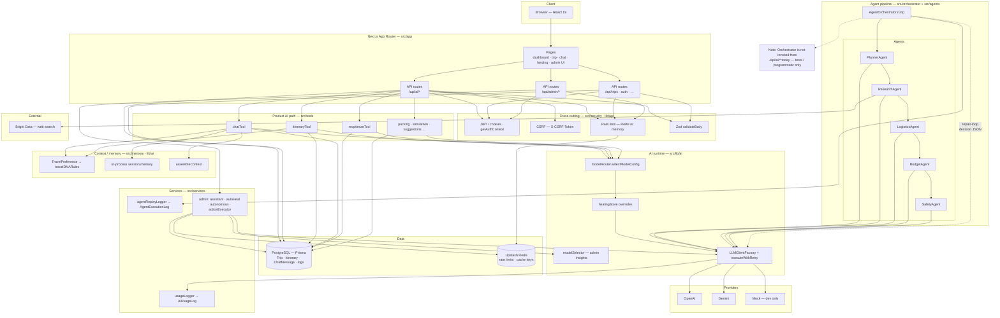
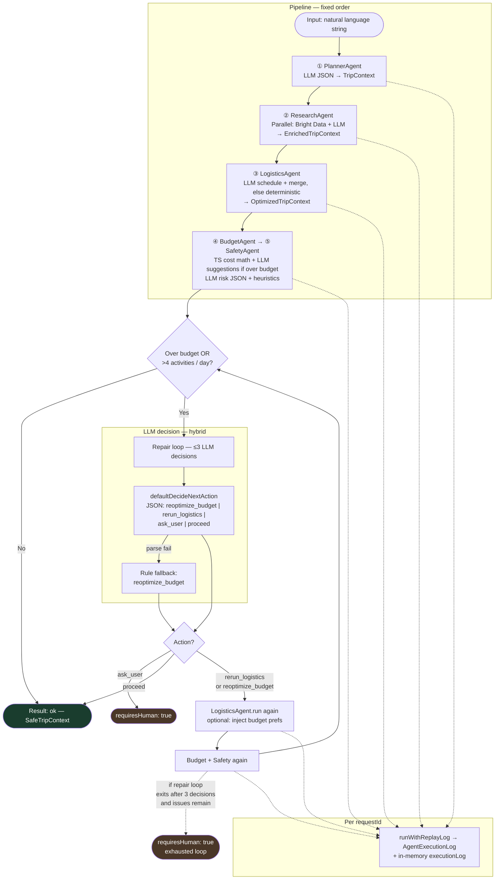

# VoyageAI — Production Architecture Audit

**Document type:** As-built architecture and gap analysis (codebase audit).  
**Stack verified against:** Next.js 16 App Router, Prisma 7, PostgreSQL, in-repo `src/` (March 2026).

---

## Visual architecture (Mermaid)

### Whole system — layers, data stores, and dual AI paths

The diagram shows **how the shipped product talks to AI** (tools + routes) versus the **multi-agent pipeline** (orchestrator + agents), which shares the same LLM and persistence primitives.



### Agents — orchestrator sequence, repair loop, and outputs



**How to read the agent diagram:** Steps ①–⑤ always run once. The **repair loop** only activates when budget or density checks fail; the small **orchestrator LLM** chooses the next remediation. **`ask_user`** returns **human-in-the-loop** immediately. The **dashed line** to `H2` is the **exhausted-loop** path (three decision rounds used, constraints still violated, user did not choose `proceed`).

---

## 1. System overview

**What VoyageAI is:** A travel planning web application where authenticated users create trips, generate AI itineraries, chat about trips, reoptimize plans, and use ancillary AI features (packing lists, risk simulation, dashboard suggestions). Admin users get an operations dashboard with AI-assisted diagnostics and optional autonomous/healing hooks.

**Core capabilities:**

- JWT/cookie-based auth with refresh rotation; role-aware admin area.
- Trip CRUD and itinerary persistence (`Trip`, `Itinerary`, `ChatMessage`).
- Multiple **AI tools** exposed as REST routes under `/api/ai/*` (itinerary, chat, reoptimize, packing, simulation, landing prompt bar, create-trip-from-text, etc.).
- A separate **multi-agent pipeline** (Planner → Research → Logistics → Budget → Safety) implemented as TypeScript classes and coordinated by `AgentOrchestrator`.

**Key differentiators (intended design):**

- **AI:** Structured JSON outputs, Zod-validated requests, sanitization and post-generation checks; primary OpenAI with Gemini fallback via retry layer; optional auto-healing overrides on model config.
- **Agents:** Specialized agents with clear boundaries (research uses web grounding; budget uses deterministic math; logistics merges LLM scheduling back onto canonical activity objects).
- **Autonomy (admin):** Anomaly-driven proposals, guard-enforced action allow-lists, and execution of safe admin actions — distinct from the main user itinerary path.

**Critical architectural fact:** The **product-facing itinerary and chat flows do not call `AgentOrchestrator`**. They call **`src/tools/*`** directly from API routes. The orchestrator is implemented and unit-tested but **not wired to HTTP** in the current codebase.

---

## 2. Tech stack

| Layer | Technology |
|--------|------------|
| **Frontend** | React 19, Next.js 16 App Router, Tailwind 4, Framer Motion, Mapbox GL, D3, Zustand, `@dnd-kit` |
| **Backend** | Next.js Route Handlers (`src/app/api/**`), server-side services under `src/services`, `src/tools` |
| **AI providers** | OpenAI (`@` API via custom client), Google Gemini (`@google/generative-ai`), dev **MockLLMClient** when keys/provider unset |
| **Database** | PostgreSQL via Prisma 7 (`@prisma/client`, `@prisma/adapter-pg`, `pg`) |
| **Cache / rate limit** | Upstash Redis (`@upstash/redis`) in production; in-memory fallback for rate limiting in dev |
| **Security** | bcryptjs, jsonwebtoken, signed CSRF tokens (HMAC), cookie-based session material |
| **Testing** | Vitest (`src/orchestrator/__tests__/`, tool tests) |

---

## 3. High-level architecture

### Canonical user path (actual production shape)

```
User → Browser (React) → Next.js API Route → Tool/service layer → LLMClient (+ optional Bright Data) → PostgreSQL → JSON response → UI
```

### Agent pipeline path (implemented, not exposed as primary API)

```
Natural language (string) → AgentOrchestrator.run() → sequential agents → in-memory TripContext graph → OrchestratorResult (no default persistence)
```

### Request lifecycle (typical authenticated AI call)

1. Client sends `POST` with JSON body; many mutating calls include `X-CSRF-Token`.
2. Route uses `validateBody` (Zod), `getAuthContext` (JWT from header or cookie), ownership checks on `Trip` where applicable.
3. `checkRateLimit('ai:<userId>:<endpoint>')` runs (Redis or memory).
4. Optional: `getTravelPreferenceContext` / `assembleContext` / `buildMemoryContext` inject preferences and session context.
5. Tool invokes `selectModelConfig({ endpoint })` (and sometimes `executeWithRetry`) to call the LLM.
6. Output validated/sanitized; itinerary paths may transactionally write `Itinerary` + update `Trip`.
7. Errors mapped via `formatErrorResponse` (includes provider busy → 503 patterns where implemented).

### Key boundaries

- **API routes:** HTTP, auth, rate limits, persistence orchestration.
- **Tools (`src/tools`):** Use-case-specific prompts and parsing; primary integration point for product AI.
- **Agents (`src/agents`):** Specialized steps for the multi-agent trip graph; consumed by `AgentOrchestrator` only.
- **LLM layer (`src/lib/ai`):** Provider abstraction, retries, usage logging, model routing tables.

---

## 4. Orchestrator design (critical)

### Location and entry point

- **File:** `src/orchestrator/agentOrchestrator.ts`
- **Class:** `AgentOrchestrator`
- **Public API:** `run(input: string): Promise<OrchestratorResult>`

### How it is triggered

- **In repository:** Instantiation appears in **`src/orchestrator/__tests__/agentOrchestrator.test.ts` only**. No `src/app/api/**` route imports `AgentOrchestrator`.
- **Implication:** The orchestrator is a **first-class subsystem** for pipeline logic and replay logging, but **not the live user-facing itinerary generator**.

### Agent selection model

- **Not dynamic “pick one agent.”** The orchestrator runs a **fixed pipeline**:
  1. Planner  
  2. Research  
  3. Logistics  
  4. Budget + Safety (paired)

**LLM involvement in routing:** Only inside the **post-validation loop**. After the first budget+safety pass, if the trip is **over budget** and/or **too dense** (more than four activities on any day), the orchestrator calls `decideNextAction` (default: `defaultDecideNextAction`).

- That decider is **hybrid**:
  - **LLM:** Small JSON decision `{ "action": "reoptimize_budget" | "rerun_logistics" | "ask_user" | "proceed" }` with temperature 0.
  - **Rule fallback:** Invalid JSON, LLM failure, or unknown action → **`reoptimize_budget`**.
  - **Rule thresholds:** `MAX_ITERATIONS = 3` for decision rounds; dense-day threshold aligned with safety heuristics.

### Flow: User intent → orchestrator → execution → response

1. **Input:** Single free-text string (user trip intent).
2. **Planner** produces `TripContext` (destination, dates, themes, preferences).
3. **Research** enriches days and hotels (Bright Data + LLM).
4. **Logistics** assigns time slots and picks a hotel (LLM with deterministic fallback).
5. **Budget** computes costs in TypeScript; optional LLM suggestions when over budget.
6. **Safety** runs heuristics + LLM JSON risk assessment (`executeWithRetry`).
7. **Validation loop:** Re-run logistics (optionally with budget preference injected) + budget + safety until resolved, max three LLM decisions, or **human-in-the-loop** return (`requiresHuman: true`).

### Fallback, errors, retries

- **Per-stage errors:** Failure in planner/research/logistics returns `ok: false` with `stage` set; budget failure aborts stage; safety failure in orchestrator is caught and **downgraded** to a safe default context (`riskLevel: "low"`, empty warnings) so the pipeline can complete.
- **Logistics:** Up to two LLM attempts; then **deterministic** slot assignment + hotel scoring.
- **Research:** Two full attempts at LLM+validation if the first fails.
- **Planner:** JSON repair pass via second LLM call if parse fails once.
- **LLM provider level:** `executeWithRetry` implements exponential backoff and can switch to alternate provider on rate limits when keys exist (see `src/lib/ai/llm.ts`).

### Observability hook

- `runWithReplayLog` (`src/services/ai/agentReplayLogger.ts`) writes **sanitized** rows to `AgentExecutionLog` when Prisma delegate is available, correlated by `requestId`.

---

## 5. Agent system

Below: **pipeline agents** used by `AgentOrchestrator`. These are separate from the **tool** layer that powers `/api/ai/itinerary`, etc.

### Planner Agent (`src/agents/planner/plannerAgent.ts`)

| Aspect | Detail |
|--------|--------|
| **Purpose** | Turn natural language into a structured `TripContext` (destination, duration, dates, themed days, preferences). |
| **Inputs** | `input: string`, optional `requestId` for logs. |
| **Outputs** | `TripContext` after `validateAndNormalize` (defaults for invalid duration/dates; style/pace enums enforced). |
| **Tools** | None external. |
| **LLM** | `LLMClientFactory.create({ agent: "planner" })` → OpenAI **`gpt-4.1`** when provider is OpenAI; JSON response, repair path on bad JSON. |
| **Example task** | “4 days in Lisbon, relaxed pace, $2000 budget” → structured plan with day themes. |

### Research Agent (`src/agents/research/researchAgent.ts`)

| Aspect | Detail |
|--------|--------|
| **Purpose** | Enrich each day with 3–5 activities and **3–5 hotel options total**; must not pick final hotel or compute totals. |
| **Inputs** | `TripContext`. |
| **Outputs** | `EnrichedTripContext` (`days` with activities, `hotels[]`). |
| **Tools** | **Bright Data** searches: `searchAttractions`, `searchHotels`, `searchRestaurants` (`src/tools/brightDataTool.ts`). |
| **LLM** | `buildFullPrompt` + `selectModelConfig({ endpoint: "research" })` + `executeWithRetry`; validates/sanitizes output; merges onto input days. |
| **Example task** | Ground “museums day” with real venue names from search snippets, output JSON matching schema. |

### Logistics Agent (`src/agents/logistics/logisticsAgent.ts`)

| Aspect | Detail |
|--------|--------|
| **Purpose** | Assign `morning|afternoon|evening` slots, reorder for variety, select **one** hotel from the provided list. |
| **Inputs** | `EnrichedTripContext`. |
| **Outputs** | `OptimizedTripContext` (scheduled activities + `selectedHotel`). |
| **Tools** | None external; preprocessing caps activities by pace. |
| **LLM** | Primary path: LLM JSON → `mergeLLMResult` (strict match to original activity names/types); **deterministic fallback** if validation fails. |
| **Example task** | Ensure no consecutive same-type activities; prefer central hotel when budget is tight. |

### Budget Agent (`src/agents/budget/budgetAgent.ts`)

| Aspect | Detail |
|--------|--------|
| **Purpose** | Estimate per-day and total cost; flag `isOverBudget`; optional textual suggestions. |
| **Inputs** | `OptimizedTripContext`. |
| **Outputs** | `BudgetedTripContext` with `budget` object. |
| **Tools** | None. |
| **LLM** | Only when over budget — small JSON suggestions via `selectModelConfig({ endpoint: "budget" })` and retry wrapper; **numbers are always TS-computed**. |
| **Example task** | User budget $1500 vs estimated $2200 → `budgetGap` + three suggestion strings. |

### Safety Agent (`src/agents/safety/safetyAgent.ts`)

| Aspect | Detail |
|--------|--------|
| **Purpose** | Fatigue, weather/crowd, and budget-stress signals; produce `riskLevel`, warnings, tips. |
| **Inputs** | `BudgetedTripContext`. |
| **Outputs** | `SafeTripContext` (`safety` block). |
| **Tools** | None; keyword/heuristic **pre-analysis** feeds the prompt. |
| **LLM** | `executeWithRetry`, JSON response, then `validateAndClamp` for consistency. |
| **Example task** | Packed days + famous landmarks → medium/high risk with concise warnings. |

---

## 6. Tool layer

**Location:** `src/tools/`

| Tool | Role |
|------|------|
| `itineraryTool.ts` | Full itinerary generation for dashboard; caching key; uses central prompts/schemas; **primary path for `/api/ai/itinerary`**. |
| `reoptimizeTool.ts` | Structured diff / reoptimization against existing itinerary. |
| `chatTool.ts` | Trip-scoped conversational companion. |
| `suggestionTool.ts` | Dashboard contextual suggestions. |
| `packingTool.ts` | Packing list generation. |
| `simulationTool.ts` | Trip risk / simulation style output. |
| `brightDataTool.ts` | Web search grounding (used by Research agent; not exclusive to agents). |

**How agents call tools:** Only **ResearchAgent** imports Bright Data tools directly. Other agents avoid cross-calls.

**Separation of concerns:** API routes should stay thin: validate auth, load DB entities, call **one** tool, persist results. The **orchestrator** composes **agents**, not `itineraryTool`, which keeps two parallel AI architectures in the codebase.

---

## 7. Data flow (end-to-end)

### Create trip

Typical pattern: UI → `POST /api/trips` or AI-assisted create routes → Prisma `Trip` insert → redirect/load dashboard. (Exact route chosen by UI; all persist through Prisma.)

### Generate itinerary (**product**)

`User` → `TimelineItinerary` (or similar) → `POST /api/ai/itinerary` → `generateItinerary` → LLM → validate → **transaction:** delete prior `Itinerary` rows for trip, insert new `Itinerary.rawJson`, update `Trip.budgetTotal` / `budgetCurrency` → UI refresh.

**Note:** This path does **not** run the five pipeline agents.

### Reoptimize trip

`User` → `POST /api/ai/reoptimize` → `reoptimizeTool` → LLM (diff-shaped output) → validate → persist/update (per route implementation) → UI.

### AI chat

`User` → `POST /api/ai/chat` → load `Trip` + latest `Itinerary` → `assembleContext` + **session memory** (`memory/memory.ts`) + travel preferences → `chatCompanion` → persist `ChatMessage` rows → UI.

### Suggestions

Dashboard → `POST` to suggestions API (see `suggestionTool` + route) → short JSON suggestion list → UI.

### Agent pipeline (if invoked programmatically)

`string` → `AgentOrchestrator.run` → sequential agents → `OrchestratorResult` → optional `AgentExecutionLog` rows — **no default write to `Itinerary` in orchestrator code**.

---

## 8. Memory and context

| Mechanism | Implementation | Notes |
|-----------|----------------|-------|
| **Travel DNA** | `User.preferences` (onboarding), `TravelPreference.data` JSON | `buildTravelDNARules` turns preference JSON into prompt rules. |
| **Embeddings / vector RAG** | `storeTravelDNA` / `getTravelDNA` in `memory/contextStore.ts` | **Stubs** — return null / no-op; not production RAG. |
| **Session memory** | `memory/memory.ts` | In-process `Map`, rolling window + compressed preamble; **not durable** across cold starts / multi-instance. |
| **Chat history** | Request payload + `ChatMessage` table | Chat route merges DB trip data with message list. |
| **Context injection** | `lib/ai/context.ts` (`assembleContext`) | Bundles DNA, itinerary snapshot, trip meta, chat, optional extras into prompt-facing text. |

---

## 9. AI system design

### Model routing

- **Static routing:** `selectModelConfig({ endpoint, intent? })` in `modelRouter.ts` maps logical endpoints (`itinerary`, `chat`, `reoptimize`, …) to model names, temperature, max tokens, timeouts for OpenAI/Gemini/mock matrices.
- **Provider resolution:** `LLM_PROVIDER` env + key presence; production rejects mock client.
- **Per-agent OpenAI models:** `AGENT_MODELS` in `llm.ts` (e.g. planner/logistics → `gpt-4.1`, research/budget/safety/orchestrator → `gpt-4.1-mini`).
- **Auto-healing overlays:** `applyHealingOverrides` adjusts config based on `healingStore` (driven by admin/auto-heal/autonomous flows).

### Dynamic cost/quality routing (partial integration)

- **`modelSelector.ts`** implements data-driven selection from `AiUsageLog` aggregates with caching and scoring.
- **Current usage:** exposed for **admin insights** (`/api/admin/model-insights`); **not** wired into main `itineraryTool` / chat tools (commentary in file: “call in any new service”).

### Prompt structure

- Agents: dedicated prompt modules (`plannerPrompts`, `researchPrompts`, logistics inline system prompt, etc.).
- Tools: centralized prompt fragments (`lib/ai/prompts`, `SYSTEM_PROMPTS`, `SCHEMA_INSTRUCTIONS`).

### Schema validation

- HTTP layer: Zod schemas in `lib/ai/schemas` and route-local extensions (e.g. require `tripId`).
- LLM output: JSON parse + custom validators per agent/tool; `AIServiceError` codes for validation failures; `validateLLMOutput` for injection-style checks on persisted content.

### Fallback logic (OpenAI → Gemini, etc.)

- **`executeWithRetry`:** Retries with backoff; on certain errors / rate limits can flip to alternate provider client when keys exist.
- **Logistics / Planner:** Application-level second attempt or deterministic fallback (not provider switch).
- **Mock client:** Development-only; blocked in production in `LLMClientFactory`.

---

## 10. Admin and autonomous system

### Admin dashboard

- **Layout:** `src/app/admin/layout.tsx` — `requireAdmin()` gates access; renders nav, header, **`AdminAssistant`** sidebar/widget.
- **Pages (examples):** agents trace UI, AI metrics, cache, logs, explanations — backed by `/api/admin/*` routes.

### AI assistant

- **`/api/admin/assistant`:** Conversational admin helper (structured to propose actions, not arbitrary shell).

### Action executor

- **`src/services/admin/actionExecutor.ts`:** Typed actions (`CHECK_AI_PROVIDER`, `CHECK_API_LOGS`, `VERIFY_MONITORING`, `CLEAR_CACHE`, `ANALYZE_USERS`). Results logged to **`AdminActionLog`**.

### Anomaly detection and auto-heal

- **`anomalyDetector` / `autoHealing.service`:** Read metrics (e.g. from `AiUsageLog` and health aggregations), detect anomalies, **LLM or rule-based** decision, apply bounded healing actions, audit trail.

### Autonomous mode

- **`autonomousRunner.ts`:** Periodic or triggered cycle — analyze → propose actions → **`guard.ts`** validates against `AUTONOMY_MODE` (`OFF` | `SAFE` | `FULL`), confidence ≥ 0.7, per-anomaly cooldown → optional execution affecting routing knobs (e.g. prefer Gemini, token caps).

### Guard layer

- Enforces allow-lists: **SAFE** vs **FULL** vs **OFF**; rejects low-confidence or disallowed proposals; in-memory cooldown registry (resets on process restart).

### Explainability

- **`AiDecisionLog`** model + explanation service/API for recording decision type, source, reasoning summary, confidence, outcome.

---

## 11. Observability

| Signal | Mechanism |
|--------|-----------|
| **LLM usage** | `logLLMUsage` / `logLLMCallFailure` → **`AiUsageLog`** (tokens, latency, cost estimate, `callSucceeded`, `requestId`, `endpoint`) |
| **Agent pipeline steps** | **`AgentExecutionLog`** via `agentReplayLogger` (orchestrator runs) |
| **Admin actions** | **`AdminActionLog`** |
| **AI decisions** | **`AiDecisionLog`** |
| **Structured logs** | `logStructured` / `logInfo` / `logError` in infrastructure logger |
| **Latency** | Per-call `latencyMs` on LLM responses and agent replay rows |
| **Error tracking** | Application logs + DB failure rows; **no first-party Sentry SDK** observed in source (dependencies may pull OTEL transitively via Next). |

---

## 12. Security

| Control | Implementation |
|---------|----------------|
| **Authentication** | JWT access token (header or cookie); refresh token family rotation in DB; `getAuthContext` on API routes |
| **Authorization** | Trip ownership checks; admin role via `requireAdmin` |
| **CSRF** | Signed token (`csrf.edge` / cookie); client sends `X-CSRF-Token` on mutating requests |
| **Rate limiting** | `checkRateLimit` — Redis in production, memory in dev; DB model `RateLimitEntry` exists for fallback patterns |
| **Input hygiene** | `sanitizeUserInput`, Zod validation, `validateLLMOutput` where applied |
| **Secrets** | Env validation (`infrastructure/env.ts`); production requires real `CSRF_SECRET` |

---

## 13. Current gaps

1. **Orchestrator not wired to product APIs** — The five-agent pipeline is isolated; users consume `itineraryTool`, not `AgentOrchestrator`.
2. **`agentRegistry.ts` is an empty stub** — No runtime discovery or plugin registration.
3. **Dual AI architectures** — Risk of drift: two different ways to produce trips (tool vs agents); maintenance and product semantics must stay aligned intentionally.
4. **`modelSelector` unused in hot path** — Cost/speed optimization engine exists but main tools use static `modelRouter` only.
5. **Travel DNA RAG stubs** — No embedding-backed retrieval; preferences are JSON → rules string only.
6. **Session memory is process-local** — Unreliable in multi-instance or aggressive serverless scaling without shared store.
7. **Bright Data dependency** — Research agent degrades to LLM-only when grounding is empty; quality depends on external search availability/config.
8. **Safety agent throws on LLM failure** — Orchestrator masks with default “low” safety; may hide real failures from callers that bypass orchestrator.
9. **Observability** — Strong DB logging; no distributed tracing standard across all paths documented in code.

---

## 14. Production readiness (qualitative scores)

Scores are **1–5** (5 = production-grade for a Series A–style SaaS). They reflect **what is implemented**, not aspirational docs.

| Dimension | Score | Rationale |
|-----------|-------|-----------|
| **Architecture** | **3.5** | Clear layering; two parallel AI paths create conceptual debt; admin subsystem is thoughtful. |
| **Agents** | **4** (code) / **2** (product integration) | Agents are well-factored and tested but **not** on the main user itinerary path. |
| **AI system** | **4** | Solid provider abstraction, retries, usage logging, healing hooks; dynamic selector underutilized. |
| **Reliability** | **3.5** | Good fallbacks in logistics and LLM retry; in-memory memory and optional external search weaken guarantees. |
| **Scalability** | **3** | Stateless API design fits horizontal scale; Redis rate limits OK; Prisma/Postgres standard; session memory and singleton LLM client warrant review at high concurrency. |

---

## Summary for engineers and reviewers

VoyageAI is a **Next.js monolith** with a **mature tool-based AI surface** for users and a **separately engineered multi-agent pipeline** that implements orchestration, replay logging, and human-in-the-loop repair logic. For academic or stakeholder evaluation: treat the **orchestrator** as a **reference implementation** of agent coordination until it is **explicitly invoked** from an API route or service that replaces or complements `generateItinerary`.

---

*End of document.*
